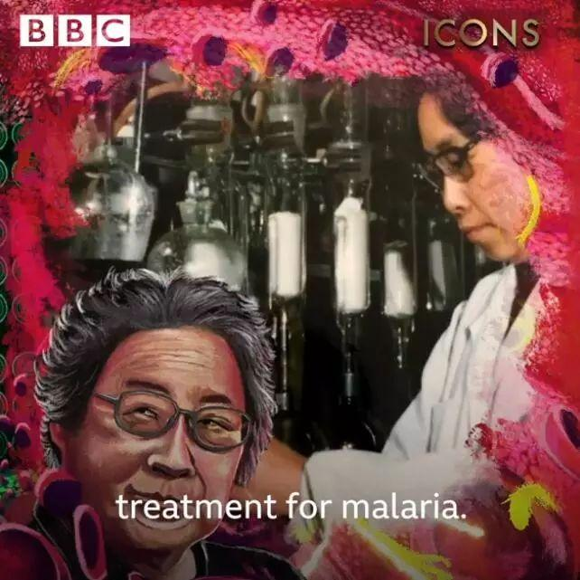
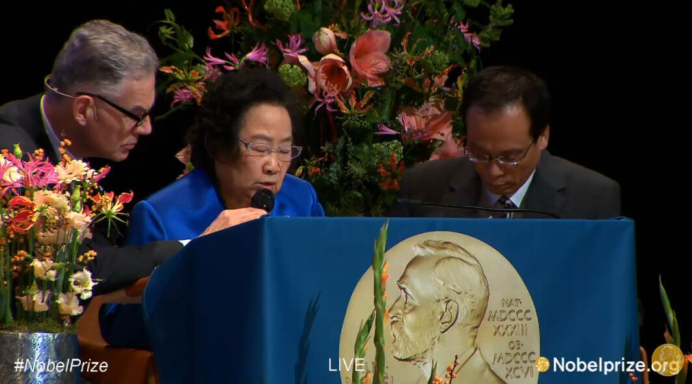
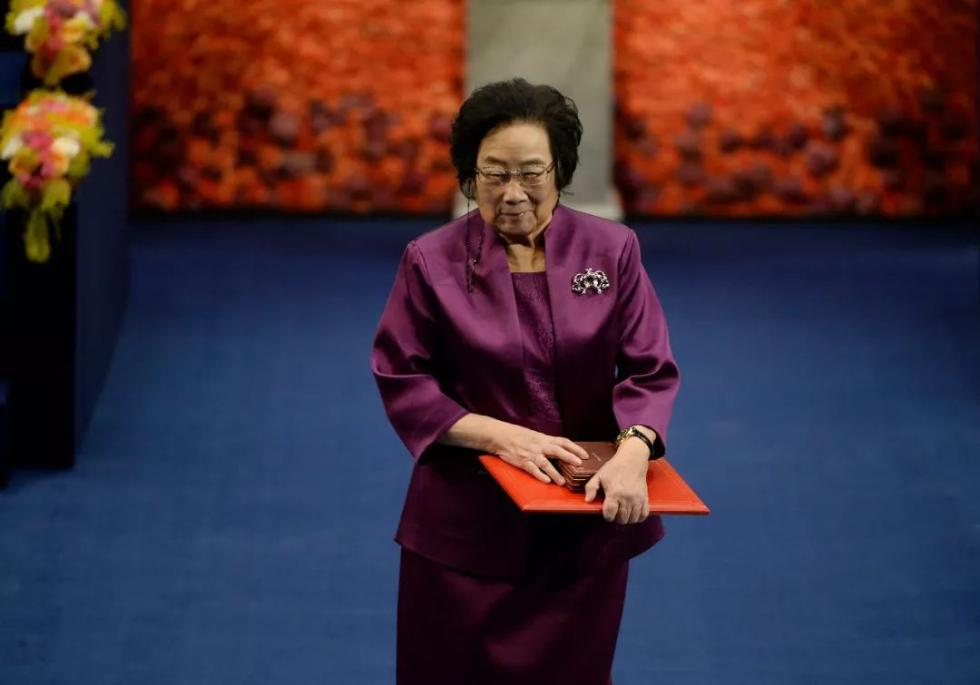

> “如果用拯救多少人的生命来衡量伟大程度，那么屠呦呦无疑是史上最伟大的科学家之一!” - BBC

屠呦呦之名来源于《诗经》中“呦呦鹿鸣，食野之蒿”给她取名，这种奇妙的联系仿佛是一种预言。许多年后，因为这株叫“青蒿”的小草，她打破了在自然科学领域，中国本土科学家获诺贝尔奖“零”的记录。

都说，她的名字和她的发现就像命中注定一样，但屠呦呦发现青蒿素的过程，可谓历尽了千难万险。

上世纪60年代，39岁的屠呦呦受国家领导人的任命，开始致力于进行寻找治疗疟疾药方的研发。

疟疾——这种传染性极强的疾病，一直威胁着全世界人类的生命健康。有数据显示，世界上一半的人口都存在患有罹患疟疾的风险之中。当时，有很多机构和科学家都想要攻破这一人类难题，可惜全都失败了。面对所有人的质疑，屠呦呦却带着科研的信仰，排除万难，表示愿意牺牲一切个人利益。

之后她作为中国中医带领研究院，独立前往河南开展研究，在一次次试验中不断前行。

屠呦呦从中国古籍中受到启发。她发现《肘后备急方》中有这样一句话：“青蒿一握，以水二升渍，绞取汁，尽服之。” 伴随着屠呦呦的发现，现在以青蒿素为基础，已经有了疟疾治疗的联合疗法(ACT)。

> 正如BBC纪录片——20世纪最伟大科学家中给的三大理由所讲，屠呦呦在艰难时刻仍然秉持科学理想，砥砺前行亦不忘回望过去，她的成就跨越东西。

2015年10月5日，瑞典卡罗琳医学院宣布将*诺贝尔生理学或医学奖*授予屠呦呦。这是中国医学界迄今为止获得的最高奖项，也是中医药成果获得的最高奖项。

她用一生的科研让无数外国人为之敬佩，甚至反思自身的懒惰作风。她身体力行告诉你什么叫——“坚持的意义在时光里”。

